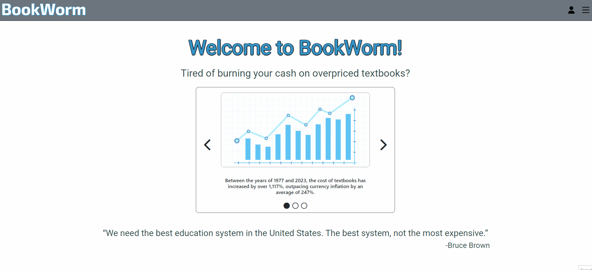

# BookWorm

A full stack React application for college students who want to trade and sell textbooks.

## Why I Built This

As a college student, I often struggled with the idea of spending several hundreds of dollars on textbooks I may or may not even use for my college courses. I wish there had been a platform for students to easily sell and trade their used books.

## Technologies Used

- React.js
- Bootstrap 5
- Node.js
- PostgreSQL
- AWS S3
- JSON Web Tokens
- Webpack
- Babel
- HTML5
- CSS3
- Dokku

## Live Demo

Try the application at [https://book-worm.noahlett.com](https://book-worm.noahlett.com "BookWorm")

## Features

- Users can view a "wanted" list of books that are currently in demand
- Users can view a "for sale" list of books that currently being offered for sale or trade
- Users who have accounts and are signed in may create a "wanted" post which will appear in the "wanted" list
- Users who have accounts and are signed in may create a "for sale" post which will appear in the "for sale" list
- Users who have accounts and are signed in may edit their own "wanted" posts
- Users who have accounts and are signed in may edit their own "for sale" posts
- Users who have accounts and are signed in may delete their own "wanted" posts
- Users who have accounts and are signed in may delete their own "for sale" posts
- Users can create accounts with a password and unique username
- Users can sign in to their accounts
- Users can sign out of their accounts

## Preview

## Features to be Added

- Users can search for a book on the "for sale" page by either ISBN or title
- A loading spinner to be displayed while data is being relayed

## Development

### System Requirements

- Node.js 10 or higher
- NPM 6 or higher
- PostgreSQL
- Argon2
- Express
- MulterS3
- React
- JWT

### Getting Started

1. Clone the repository
2. Install all dependencies using npm
3. Set up an account with AWS S3 and establish a bucket to retain images uploaded by users
4. Make a copy of the .env file and add the necessary environment variables, including a token secret, database URL, and AWS bucket information
5. Run db:import to establish database
6. Start PostgreSQL sudo service
7. Run dev to start server
8. Open in browser at localhost:3000
